# 🏋️‍♂️ Fitness App 🥗💤

Welcome to the **Fitness App**, a Flutter-based application developed with 💙 Dart. This app is designed to help you stay on top of your health with these incredible features:

- **Full Body Tracker** 🏋️‍♀️: Track your fitness progress and monitor your workouts effectively.
- **Meal Tracker** 🍎: Keep a log of your meals and ensure a balanced diet.
- **Sleep Tracker** 😴: Monitor your sleep patterns to maintain a healthy lifestyle.

---

## 🚀 Features
- Stunning UI designed to offer an intuitive experience.
- Modern design aesthetics to make tracking fun and engaging.
- All-in-one solution for health tracking needs!

> **Note:** This app currently includes only the UI implementation, with backend functionality planned for future updates.

---

## 📸 Screenshots

Here are some glimpses of the app:

  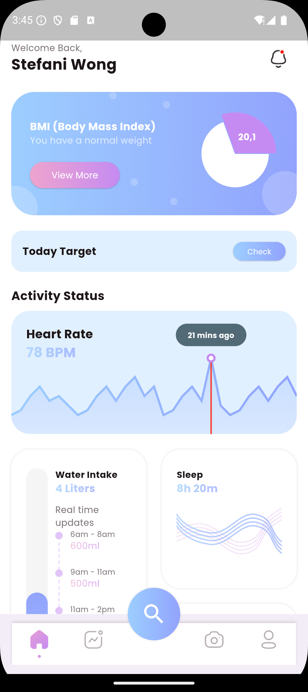
  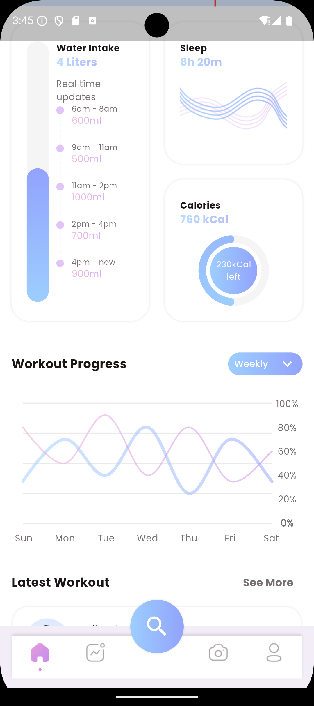
  
  
  
  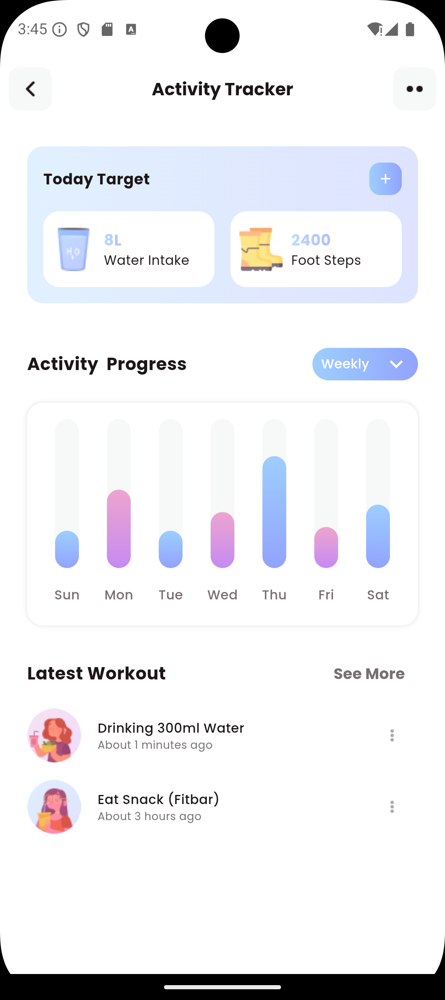
  
  
  
  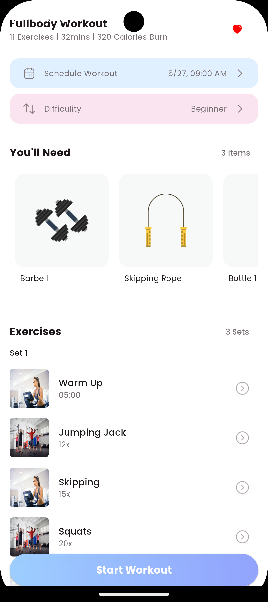
  
  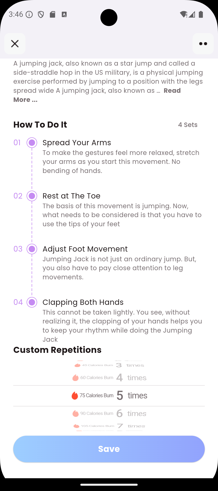
  
  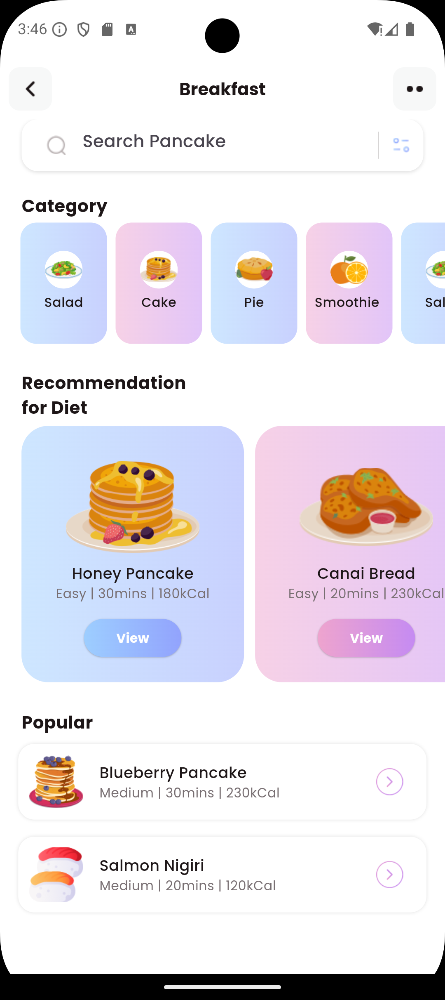
  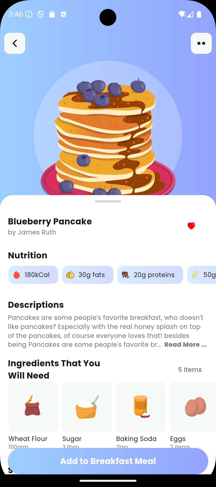
  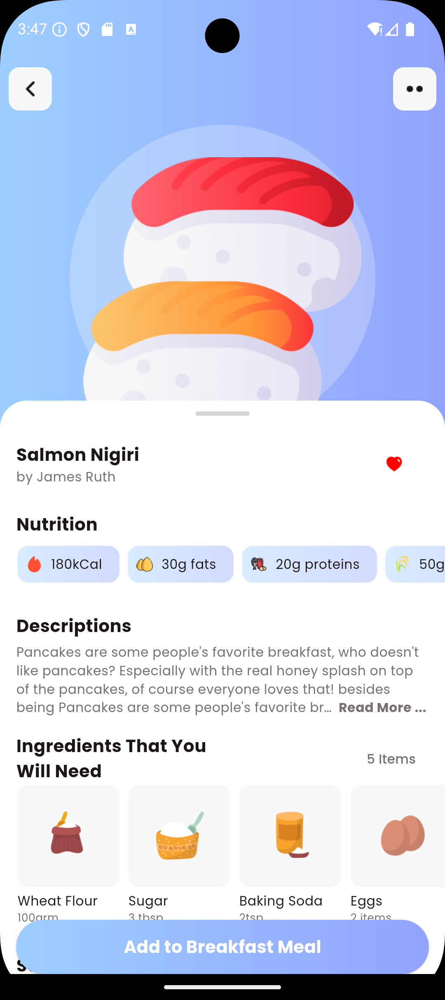
  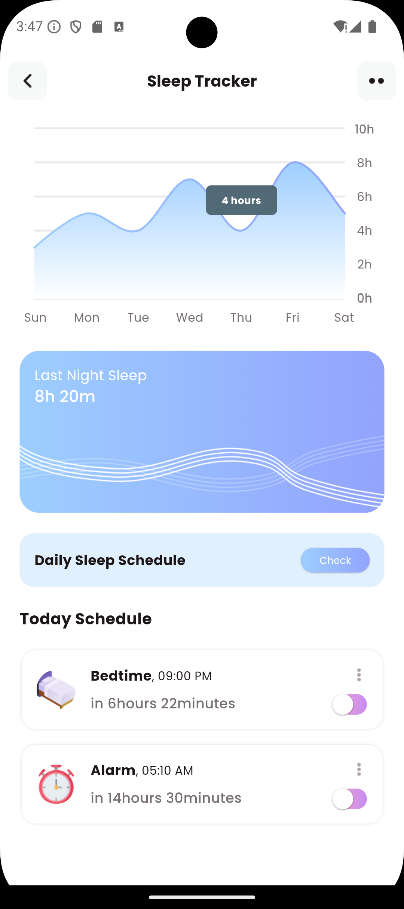
  
  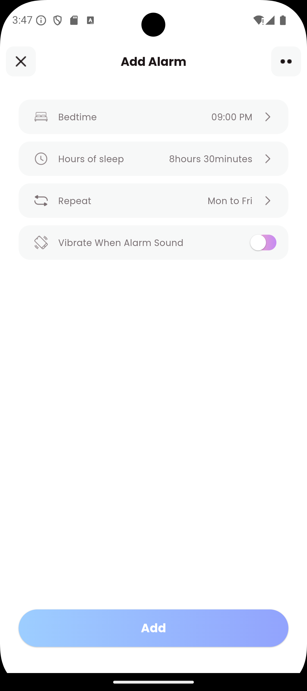
  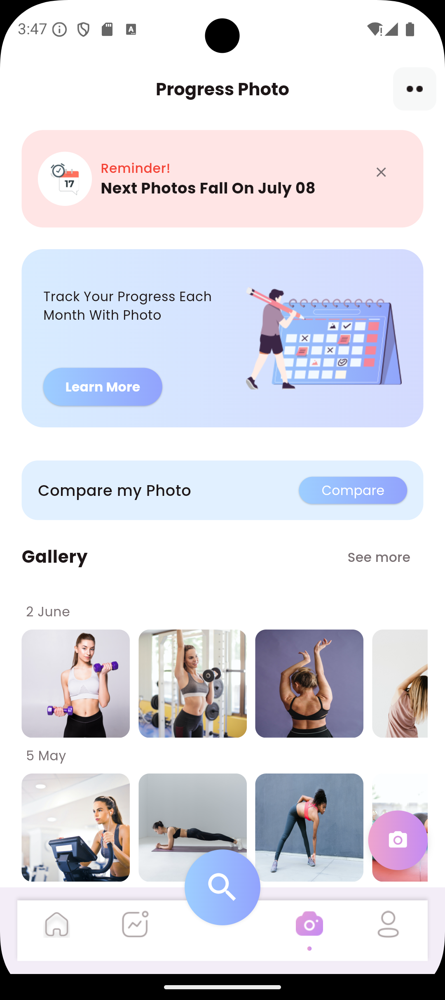
  

---

      
